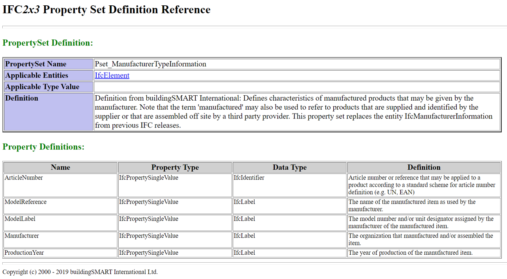

# Ideas XML for IDS - v 00.1

Arie van Kranenburg

## Apologies for the somewhat raw presentation

- I started with the design last saterday (first day after Friday meeting)
- I had to do some other work too
- I changed the XML design during the preparation of the presentation

So:

- The examples are not complete (but clear enough, I hope)
- There will be spelling failures
- There will be some syntax errors (Powerpoint has no syntax checking)
- Refinements are needed

## Keep in mind

- The XML is the schema for the IFC propertysets
- An XSD is just for validating the XML
- We need other tools for validating the IFC
- We need “plugin” for the different authoring systems
- We need tools for defining IDS XML definitions
- But in the first step a XML-editor will do the job

## IFC property inheritance (0.01: Only SingleValue)

- IfcProperty (A)
  - IfcComplexProperty
  - IfcSimpleProperty (A)
    - IfcPropertyBoundedValue
    - IfcPropertyEnumerated
    - IfcPropertyListValue
    - IfcPropertyReferenceValue
    - **IfcPropertySingleValue**
    - IfcPropertyTableValue

## Enumeration also mapped on SingleValue

- Enumeration only known outside the IFC file
- This needs a mapping for the standard properties (later)

## Types in version 0.1 (based on IFC2x3)

type | IFC type | definition
------- | ------- | -------
integer IfcInteger | Defined type of simple type INTEGER.
real | IfcReal | Defined type of simple type REAL.
boolean IfcBoolean | Defined type of simple type BOOLEAN.
? | IfcLogical | Defined type of simple type LOGICAL.
id | IfcIdentifier | Defined type of simple type STRING for identification purposes.
label | IfcLabel | Defined type of simple type STRING for naming purposes.
text | IfcText | Defined type of simple type STRING for descriptive purposes.

## Why 3 types of string?

- IFC uses them for different purposes
- IfcIdentifier for identification
- IfcLabel for naming
- IfcText for descriptions (but not always)
- In IFC4 the length is maximized
- IfcIdentifier STRING[255]
- IfcLabel STRING[255]
- IfcText STRING[32767]
- The definitions of IfcIdentifier and IfcLabel are identical

## Starting point

- Agreements of last friday
- Short tag names, can be changed
- Attributes for ID’s, references, types, values and units
- Elements for names and descriptions
- Can we do the attribute/element discussion later?

## What’s not in (for now)

- Multi-language support
- Hierarchical classification
- Mapping properties on standard psets
- Rule checking

## Information included in v 0.01

- Units
- Items for enumerations (predefined name values)
- Properties
  - type: integer/real/boolean/id/label/text
  - unit: reference to a specific unit
- PropertySets (set of properties)
- Classes
  - IFC mapping on the subtype of IfcElementType
  - Pset of the ElementType
  - Pset of the Element (instance)

All elements can have ID and name

## Proposal overall structure of the XML definition

``` xml
<?xml version="1.0" encoding="utf-8"?>
<IDS>
<properties>
<prop>...</prop>
<header>
<!--more properties-->
<prop>...</prop>
<version>**0.1**</version>
<!--PM to be completed later-->
</header>
</properties>
<psets>
<units>
<pset>...</pset>
<unit>...</unit>
<!--more units-->
<unit>...</unit>
</units>
<!--more propertysets-->
<pset>...</pset>
</psets>
<classes>
<class>...</class>
<enums>
<enum>...</enum>
<!--more enums-->
<enum>...</enum>
</enums>
<!--more classes-->
<class>...</class>
</classes>
</IDS>
```

## Units

``` xml
<units>
<unit ID="**mmID**">
<name>**millimetre**</name>
<abbr>**mm**</abbr>
</unit>
<unit ID="**litreID**">
<name>**litre**</name>
<abbr>**l**</abbr>
</unit>
<unit ID="**WattID**">
<name>**Watt**</name>
<abbr>**W**</abbr>
</unit>
</units>
```

## Enums (example is Status property in IFC)

``` xml
<enums>
<enum ID=*'**NewID***'>
<name>**New**</name>
</enum>
<enum ID=*'**ExistingID***'>
<name>**Existing**</name>
</enum>
<enum ID=*'**DemolishID***'>
<name>**Demolish**</name>
</enum>
<enum ID=*'**TemporaryID***'>
<name>**Temporary**</name>
</enum>
</enums>
```

## Properties (of element types)

``` xml
<prop ID='**HeatEmissionID**' type='**real**' unit='**WattId**'>
<name>**Heat emission EN442 75/65/20**</name>
<desc>**Heat emission with an input temperature of 75 degrees, etc**<desc>
</prop>
<prop ID='**WaterContentID**' type='**real**' unit='**LitreID**'>
<name>**Water content**</name>
</prop>
<prop ID='**PanelTypeID**' type='**integer**'>
<name>**Panel type**</name>
<enum val='10'/>
<enum val='11'/>
...
<enum val='44'/>
</prop>
```

## Properties (of elements)

``` xml
<prop ID='**RequiredOutputID**' type='**real**' unit='**WattId**'>
<name>**Required output**</name>
<desc>**Required heat emission of this particular radiator**<desc>
</prop>
<prop ID='**StatusID**' type='**label**'>
<name>**Status**</name>
<enum ref='**NewID**'/>
<enum ref='**ExistingID**'/>
<enum ref='**DemolishID**'/>
<enum ref='**TemporaryID**'/>
</prop>
```

## Propertysets (just a set of properties)

``` xml
<pset ID=**'PanelRadiatorTypePsetID**'>
<name>**Panel radiator type properties**</name>
<prop ref=**'HeatEmissionID**'/>
<prop ref=**'WaterContentID**'/>
<prop ref=**'PanelTypeID**'/>
</pset>
<pset ID=**'PanelRadiatorPsetID**'>
<name>**Panel radiator properties**</name>
<prop ref=**'RequiredOutputID**'/>
<prop ref=**'StatusID**'/>
</pset>
```

## Class (generic part)

``` xml
<class ID='**PanelRadiatorID**'>
<name>**Panelradiator**</name>
<desc>**Body made of steel filled with water to heat a space**<desc>
type and element part (see next sheet)
</class>
```

## Class (type/element part with IFC mapping)

``` xml
<etyp>
<pset ref='**PanelRadiatorTypePsetID**'/>
<map2>
<ifc2>**IFCSPACEHEATERTYPE/PANELRADIATOR**</ifc2>
<ifc4>**IFCSPACEHEATERTYPE/RADIATOR**</ifc4>
<ifc5>**IFCELEMENTTYPE/PanelRadiator**</ifc5>
</map2></etyp>
<elem>
<pset ref='**PanelRadiatorPsetID**'/>
<map2>
<ifc2>**IFCENERGYCONVERSIONDEVICE**</ifc2>
<ifc4>**IFCSPACEHEATER**</ifc4>
<ifc5>**IFCELEMENT**</ifc5>
</map2></elem>
```

## Relation between element and type is fixed

ElementType | Element
------------ | -------
IFC2 IFCSPACEHEATERTYPE | IFCENERGYCONVERSIONDEVICE
IFC4 IFCSPACEHEATERTYPE | IFCSPACEHEATER
IFC5 IFCELEMENTTYPE | IFCELEMENT

## Class (Panel radiator)

``` xml
<class ID='**PanelRadiatorID**'>
<name>**Panel radiator**</name>
<desc>**Body made of steel filled with water to heat a space**<desc>
<etyp>
<pset ref='**PanelRadiatorTypePsetID**’/>
</etyp>
<elem>
<pset ref='**PanelRadiatorPsetID**’/>
</elem>
<ifc2>**IFCSPACEHEATERTYPE/PANELRADIATOR**</ifc2>
<ifc4>**IFCSPACEHEATERTYPE/RADIATOR**</ifc4>
<ifc5>**IFCELEMENTTYPE/PanelRadiator**</ifc5>
</class>
```

## Possibilities for ID

- Descriptive name
- UID (local unique)
- GUID (global unique)
- URI (web-adress-like)

All are possible with the same XML definition, it’s just content

## Using descriptive name as ID

- This is already the case for the standard Psets
- No plug-in needed at the receiving side (viewer)

Let us see what happens to the XML then

### Name=ID 1: units and props (no enums needed)

``` xml
<units>
<unit ID='**mm**’/> <unit ID='**l**’/> <unit ID='**W**’/>
</units>
<props>
<prop ID='**Heat emission EN442 75/65/20**' type='**real**' unit='**W**’/>
<prop ID='**Water content**' type='**real**' unit=‘**l**’/>
<prop ID='**Panel type**' type='**integer**’>
<enum val='10’/>...<enum val='44'/></prop>
<prop ID='**Required output**' type='**real**' unit='**W**’/>
<prop ID='**Status**' type='**label**’>
<enum val='**New**’/>
<enum val='**Existing**'/>
<enum val='**Demolish**’/> <enum val='**Temporary**'/></prop>
</props>
```

### Name=ID 2: psets and classes

``` xml
<psets>
<pset ID=**'Panel radiator type properties**'>
<prop ref=**'Heat emission EN442 75/65/20**'/>
<prop ref=**'Water content**'/>
<prop ref='**Panel type**'/></pset>
<pset ID=**'Panel radiator properties**'>
<prop ref=**'Required output**'/>
<prop ref=**'Status**'/></pset></psets>
<classes>
<class ID='**Panel radiator**'>
<etyp><pset ref='**Panel radiator type properties**'/></etyp>
<elem><pset ref='**Panel radiator properties**'/></elem>
<ifc2>**IFCSPACEHEATERTYPE/PANELRADIATOR**</ifc2>
</class><classes>
```

## Propertysets in the IFC-file (schematic)

``` ifc
#1=IFCPROPERTYSINGLEVALUE('***HeatEmissionID***',$,IFCREAL(**1785.0**),$);
#2=IFCPROPERTYSINGLEVALUE('***WaterContentID***',$,IFCREAL(**10.2**),$);
#3=IFCPROPERTYSINGLEVALUE('***PanelTypeID***',$,IFCINTEGER('**22**'),$);
#5=IFCPROPERTYSET(... ,'***PanelRadiatorTypePsetID***',$,(#1,#2,#3));
#6=**IFCSPACEHEATERTYPE**(... ,(#5), ... ,.**PANELRADIATOR**.);
#10=IFCPROPERTYSINGLEVALUE(*'**RequiredOutputID***',$,IFCREAL(**1250.0**),$);
#20=IFCPROPERTYSINGLEVALUE(*'**StatusID***',$,IFCLABEL(***'NewID***'),$);
#50=IFCPROPERTYSET(... ,***'PanelRadiatorPsetID***',$,(#10,#20));
#60=IFCENERGYCONVERSIONDEVICE (...);
#61=IFCRELDEFINESBYTYPE (...,(#60),#6);
#62=IFCRELDEFINESBYPROPERTIES (...,(#60),#50);
```

## Propertysets in the IFC-file (GUID, XML needed)

``` ifc
#1=IFCPROPERTYSINGLEVALUE(**'c6f94d46-31f2-4f76-ab6d-f76564291972**',$,IFCREAL(**1785.0**),$);
#2=IFCPROPERTYSINGLEVALUE(**'f0d3fa44-f093-4058-9d70-d2e3f51b51ba**',$,IFCREAL(**10.2**),$);
#3=IFCPROPERTYSINGLEVALUE(**'a7e1e6f8-4f9b-4294-9cfa-aac25cc2d3a0**',$,IFCINTEGER('**22**'),$);
#5=IFCPROPERTYSET(... ,**'cfdfb8b8-40e4-469a-9b0f-21aa6fb82a40**',$,(#1,#2,#3));
#6=**IFCSPACEHEATERTYPE**(... ,(#5), ... ,.**PANELRADIATOR**.);
#10=IFCPROPERTYSINGLEVALUE('**a7e1e6f8-4f9b-4294-9cfa-aac25cc2d3a0**',$,IFCREAL(**1250.0**),$);
#20=IFCPROPERTYSINGLEVALUE('**6ac1d4ef-a11b-43b7-b776-652cc988d826**',$,IFCLABEL('**8432189f**-**etc**
#50=IFCPROPERTYSET(... ,'**b3c8de80-4a62-4fe0-af4a-e70f3909a62f**',$,(#10,#20));
#60=IFCENERGYCONVERSIONDEVICE (...);
#61=IFCRELDEFINESBYTYPE (...,(#60),#6);
#62=IFCRELDEFINESBYPROPERTIES (...,(#60),#50);
```

## Propertysets in the IFC-file (names as ID)

``` ifc
#1=IFCPROPERTYSINGLEVALUE('**Heat emission EN442 75/65/20 [W]**',$**,**IFCREAL(**1785.0**),$);
#2=IFCPROPERTYSINGLEVALUE('**Water content [l]**',$,IFCREAL(**10.2**),$);
#3=IFCPROPERTYSINGLEVALUE('**Panel type**',$,IFCINTEGER('**22**'),$);
#5=IFCPROPERTYSET(... ,'**Panel radiator type properties**',$,(#1,#2,#3));
#6=**IFCSPACEHEATERTYPE**(... ,(#5), ... ,.**PANELRADIATOR**.);
#10=IFCPROPERTYSINGLEVALUE(**'Required output [W]**',$,IFCREAL(**1250.0**),$);
#20=IFCPROPERTYSINGLEVALUE('**Status**',$,IFCLABEL('**New**'),$);
#50=IFCPROPERTYSET(... ,'**Panel radiator properties**',$,(#10,#20));
#60=IFCENERGYCONVERSIONDEVICE (...);
#61=IFCRELDEFINESBYTYPE (...,(#60),#6);
#62=IFCRELDEFINESBYPROPERTIES (...,(#60),#50);
```

## Mapping on/of standard psets

- Standard Pset’s have measures, no units
- It is possible to define them with the IDS XML
- They will stay compliant to the IFC standard
- But mapping on the IFC measures have to be added (later)
- It is possible to skip unwanted properties (subset)

## Pset\_ManufacturingTypeInformation



## Pset\_ManufacturingTypeInformation (in IDS XML)

``` xml
<prop ID='**ArticleNumber**' type='**id**'>
<name>**Article number**</name>
<desc>**Article number or reference that may be applied to a product...</d**esc></prop>
<prop ID='**ModelReference**' type='**label**'>
<name>**Item name**</name>
<desc>**The name of the manufactured item as used by the manufacturer**</desc></prop>
<prop ID='**ModelLabel**' type='**label**'>
<name>**Model line**</name>
<desc>**The model number and/or unit designator assigned by the m …**</desc></prop>
<prop ID='**Manufacturer**' type='**label**'>
<name>**Manufacturer name**</name>
<desc>**The organization that manufactured and/or assembled the item**</desc></prop>
<prop ID='**ProductionYear**' type='**label**'>
<name>**Model year**</name>
<desc>**The year of production of the manufactured item**</desc></prop>
```

## But now in Dutch (ID acc. IFC, name in Dutch)

``` xml
<prop ID='**ArticleNumber**' type='**id**'>
<name>**Artikelcode**</name></prop>
<prop ID='**ModelReference**' type='**label**'>
<name>**Productnaam**</name></prop>
<prop ID='**ModelLabel**' type='**label**'>
<name>**Serie**</name></prop>
<prop ID='**Manufacturer**' type='**label**'>
<name>**Fabrikant**</name></prop>
<prop ID='**ProductionYear**' type='**label**'>
<name>**Modeljaar**</name></prop>
```

## Name of the Pset also in Dutch

``` xml
<pset ID='**Pset\_ManufacturerTypeInformation**'>
<name>**Productinformatie**</name>
<prop ref=**'ArticleNumber**'/>
<prop ref=**'ModelReference**'/>
<prop ref=**'ModelLabel**'/>
<prop ref=**'Manufacturer**'/>
<prop ref=**'ProductionYear**'/>
</pset>
```

## Standard Pset added tot Class definition (etyp)

``` xml
<class ID='**PanelRadiatorID**'>
<name>**Panel radiator**</name>
<desc>**Body made of steel filled with water to heat a space**<desc>
<etyp>
<pset ref='**PanelRadiatorTypePsetID**’/>
NEWà
<pset ref='**Pset\_ManufacturerTypeInformation**’/>
</etyp>
<elem>
<pset ref='**PanelRadiatorPsetID**’/>
</elem>
<ifc2>**IFCSPACEHEATERTYPE/PANELRADIATOR**</ifc2>
<ifc4>**IFCSPACEHEATERTYPE/RADIATOR**</ifc4>
<ifc5>**IFCELEMENTTYPE/PanelRadiator**</ifc5>
</class>
```

## No property names in Dutch (as it is now)

``` ifc
#1=IFCPROPERTYSINGLEVALUE(**'ArticleNumber**',$,IFCIDENTIFIER(**'440.355.00.2**'),$);
#2=IFCPROPERTYSINGLEVALUE(**'ModelReference**',$,IFCLABEL('**Duofix element voor massiefbouw, 112 cm**'),$);
#3=IFCPROPERTYSINGLEVALUE(**'ModelLabel**',$,IFCLABEL(**'Duofix**'),$);
#4=IFCPROPERTYSINGLEVALUE(**'Manufacturer**',$,IFCLABEL(**'Geberit**'),$);
#5=IFCPROPERTYSINGLEVALUE(**'ModelYear**',$,IFCLABEL(**'2020**'),$);
#6=IFCPROPERTYSET(... ,'**Pset\_ManufacturerTypInformation**',$,(#1,#2,#3,#4,#5));
```

Dutch shows up in the values (the green ones), not in the property names

## But in a receiving application it can be

Productinformatie

Prop | Value
------- | ----------
Artikelcode | 440.355.00.2
Productnaam | Duofix element voor massiefbouw, 112 cm
Serie | Duofix
Fabrikant | Geberit
Modeljaar | 2020

No blue items anymore
But the application have to use the XML definition

## Local addition of enums (FireRating)

``` xml
<prop ID='**FireRating**' type='**label**’>
<name>**Brandwerendheid WBDBO**</name>
<enum val='**geen**'/>
<enum val='**30 min**'/>
<enum val='**60 min**'/>
<enum val='**90 min**’/>
</prop>
```

- The type of FireRating is label, so no unit min.!
- There are just 3 rating levels, there is no 45.3 min.
- There is also not something like 0 min, just no rating
- With this enumeration the following is not correct: 30m or 60 minuten

## Adding multi-language support (later)

```xml
<name lang='**EN**'>**Panelradiator**</name>
<name lang='**NL**'>**Paneelradiator**</name>
<name lang='**DE**'>**Flachheizkörper**</name>
<name lang='**FI**'>**Paneeliradiaattori**</name>
```

## Rule checking (all later)

- Validation IFC file against XML definition
- Are only allowed entities delivered
- Have all required properties a (valid) value
- This includes uniform enumeration values
- Check if properties are reasonable (diameter between min/max)
- Diameter pipe for transporting water inside building <= 100 mm
- Check if corresponding properies of elem and etyp match
- Is HeatEmission of etyp >= RequiredOutput of elem?
- Extra rule could be “within 20% margin”

## That’s all Folks
