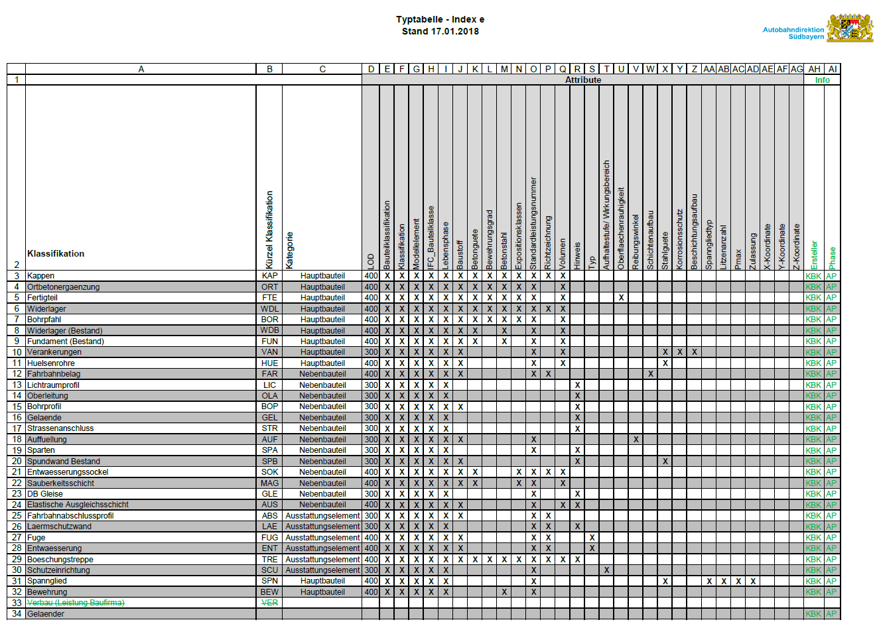
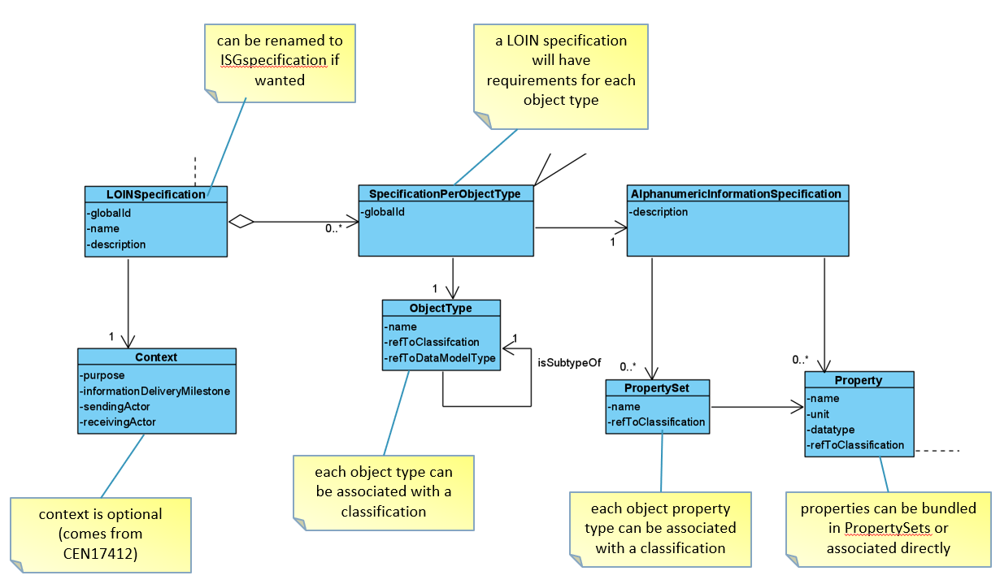
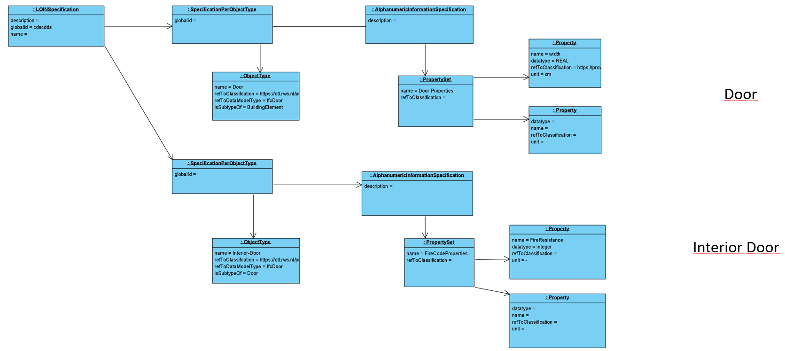
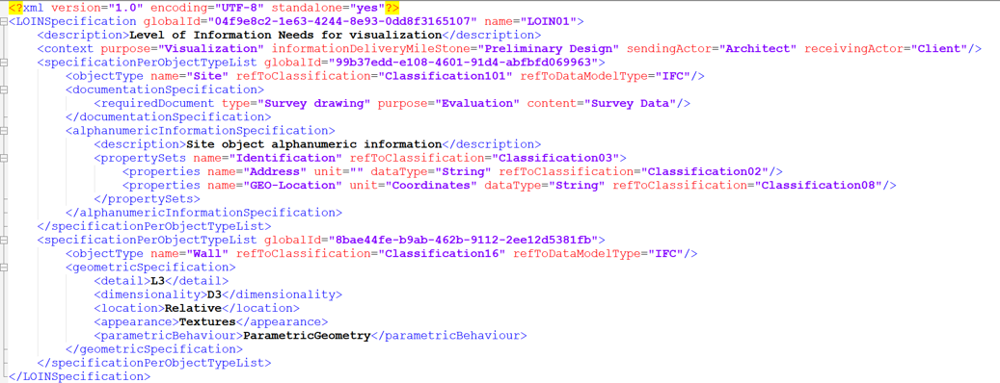
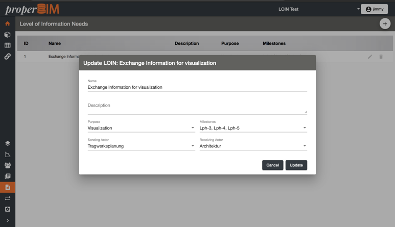

# IDS project - Proposal for a data model

**NOTE**: this README is likely surpassed by a new schema proposal, it was added as initial commit from CB.

Proposal for BuildingSmart's IDS standard for interoperable information requirements
in the context of construction projects.

Author: André Borrmann, BIMtech UG / Technical University Munich

Date: N/A

## Use Case

## UML Class diagram

Underlying rationale:

- Simplicity
- Use-case driven
- Link to data model, e.g. IFC-Entities
- Possibility to integrate classification systems
- Compatibility with CEN17412 (here focus is on semantic data)

## UML Instance diagram

## Prototypical implementation available

