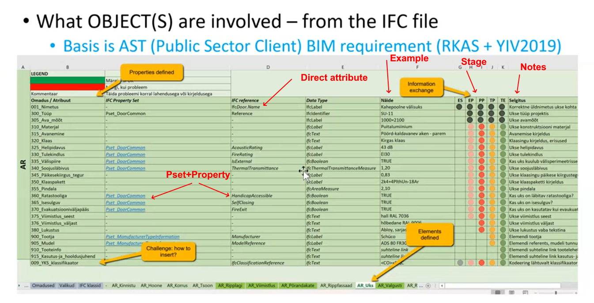

# Estonian Information Requirements

Presented by:

- Jaan Saar - jaan.saar@mkm.ee
- Aivars Alt - aivars@tktk.ee

The purpose is to support information flows in the context of BIM information flow for
the public building registry.

- Designer -> Contractor
- Contractor -> Client

Purpose:

- Remove multiple data entry and errors in the workflow.
- Avoid noise and remove irrelevant data from the models.

{#fig:figName width=100%}

Each requirement is coded, has a name, is identified as:

- [PropertySet].[PropertyName]
- [IfcType].[Attribute]
- Undefined (to be clarified): for instance the following properties can be placed in an arbitrary property.
  - 310 Material
  - 315 Opening

Properties are specified in a table per classification such as "Hanging facade" or "Door", they do not map to IFC classes.

The classification used is CCI, developed starting from the Danish System.

## Features requested

- This Use case mentions model simplification (stripping).
- They need automation of classification encoding to the modelling elements.
- Validity of the information is mentioned.
