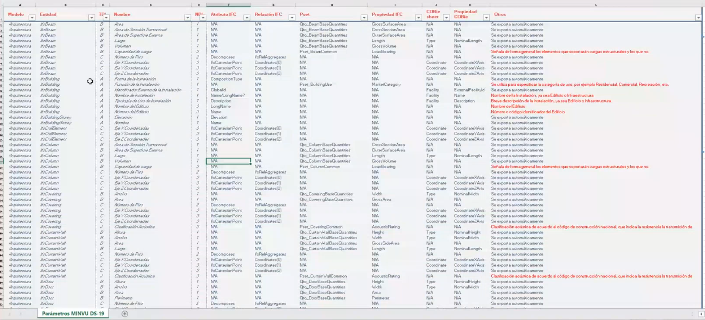

# PlanBIM Initiative - Chile

Presented by Paulina Godoy - paulina.godoy@planbim.cl

## Notes

Rich model with definition of relationships and properties required by IFC type.

Properties needed are mapped both against:

- IFC Schema, with relations
- COBie

{#fig:figName width=100%}

## Requirements

They have a problem with compliance since people do not have easy ways to support the
data insertion.

Question: Could the solution be to add the information directly in the IFC after it has been
exported.
